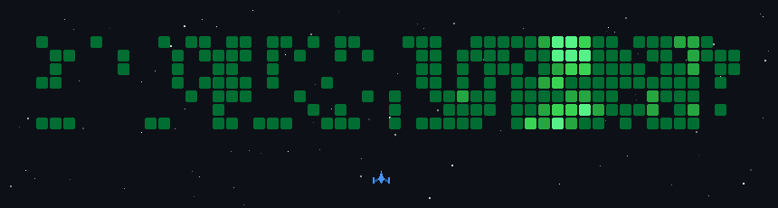

  

  

  

---

### 🚀 Hakkımda
- 👨‍🎓 Web Geliştirme, Python ve JavaScript alanlarında eğitim alıyorum.
- 💻 Yeni oyunlar yapıp kendimi geliştirmeyi seviyorum.
- 💡 Yeni siteler yapmayı seviyorum.

---

### 💻 LeetCode

---

<picture>
  
</picture>

---

### 🛠️ Teknoloji Yığınım

---

### 😎Hepsi

<table>
  <tr><td align="right"><b>Languages</b></td><td></td></tr>
  <tr><td align="right"><b>ML & Math</b></td><td></td></tr>
  <tr><td align="right"><b>Web & Mobile</b></td><td></td></tr>
  <tr><td align="right"><b>Databases</b></td><td></td></tr>
  <tr><td align="right"><b>Cloud</b></td><td></td></tr>
  <tr><td align="right"><b>DevOps & Tools</b></td><td></td></tr>
  <tr><td align="right"><b>Operating Systems</b></td><td></td></tr>
  <tr><td align="right"><b>Hardware</b></td><td></td></tr>
  <tr><td align="right"><b>Game & 3D</b></td><td></td></tr>
  <tr><td align="right"><b>Creative</b></td><td></td></tr>
</table>

---

### 🛠️ Benim Teknoloji Yığınım

---

### 👍 En İyi Yaptıklarım

---

### 📫 Bana Ulaşın

💬 Projeler, oyun geliştirme veya iş birlikleri için bana ulaşabilirsin.

---

### 🌟 Öne Çıkan Projelerim

---

### 📈 GitHub Aktivite Grafiğim

  

---

### 📊 En Çok Kullandığım Diller

  
  
  
  
  
 

---

### 🎯 2027 Hedeflerim
- 🚀 Kendi oyun motorumu geliştirmek
- 🌐 Profesyonel web siteleri oluşturmak
- 🐍 Python'da ileri seviye projeler yapmak
- 🎮 Geometry Dash tarzı oyunumu tamamlamak
- 🏆 LeetCode'da 500+ problem çözmek

---

### 🎮 İlgi Alanlarım

---

### 🧠 Kodlama Motivasyonum
> “Her gün bir satır kod = gelecekte bir büyük proje”

---

### 📊 GitHub İstatistiklerim

---

  
  

---

### 🏆 Kupalar

---

### 💻 Depolar

---

### 💀 Dinozor Oyunu

---

### 🕹️ Pacman Oyunu

<picture>
<source media="(prefers-color-scheme: dark)" srcset="https://raw.githubusercontent.com/alihan1mudayetoglu-web/alihan1mudayetoglu-web/pacman-output/pacman-contribution-graph-dark.svg">
<source media="(prefers-color-scheme: light)" srcset="https://raw.githubusercontent.com/alihan1mudayetoglu-web/alihan1mudayetoglu-web/pacman-output/pacman-contribution-graph.svg">

</picture>

---

### 🚀 Uzay Oyunu

---

### 🐍 Yılan Oyunu

  

---

 *⭐ Profilimi ziyaret ettiğiniz için teşekkürler!*

---

---

## 🌌 Kodlama Yolculuğum

  

---

## ⏳ Kodlama Seviyem

  
    
  
    
  
    
  
    
  

---

## 🌍 Dünya Haritası

  

---

## 🧩 Pixel Art

  

---

## 🎮 Achievement Rozetleri

  
  
  
  

---

## 🛰️ Matrix Yağmuru

  

---

## 🌠 Son Söz

  

---

---

## 📌 Şu Anda Üzerinde Çalıştıklarım

- 🎮 Geometry Dash tarzı oyun geliştiriyorum
- 🌐 Flask ile web projeleri yapıyorum
- 🤖 Arduino projeleri geliştiriyorum
- 🧠 LeetCode problemleri çözüyorum

---

## 📚 Şu Anda Öğrendiklerim

  
  
  
  

---

## ⚡ Eğlenceli Bilgiler

- ☕ Kod yazarken müzik dinlemeyi seviyorum
- 🎮 Oyun geliştirmek en büyük hobilerimden biri
- 🚀 Kendi oyun motorumu yapmak istiyorum
- 💡 Her gün yeni bir şey öğrenmeye çalışıyorum

---

## ⭐ Favori Teknolojilerim

  
  
  
  

---
